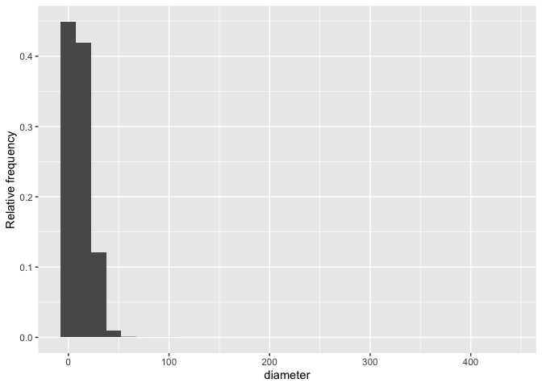
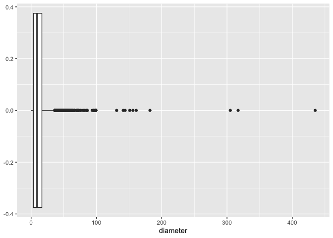
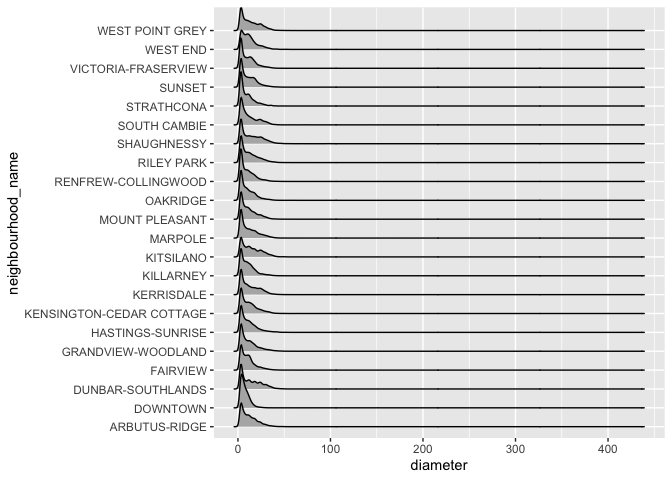
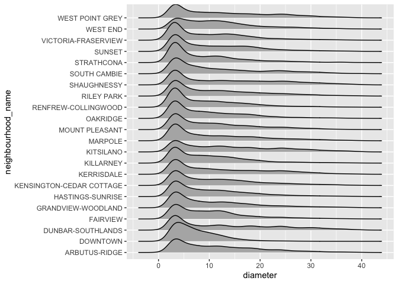
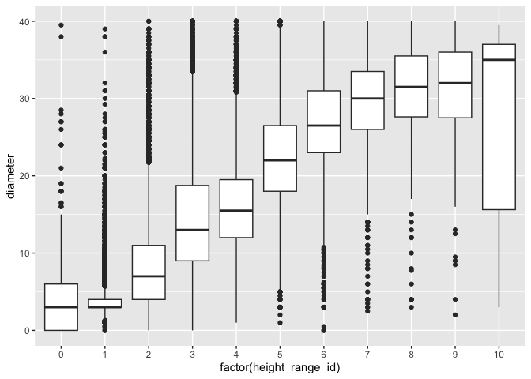

Mini Data-Analysis Deliverable 1
================

# Welcome to your (maybe) first-ever data analysis project!

And hopefully the first of many. Let’s get started:

1.  Install the [`datateachr`](https://github.com/UBC-MDS/datateachr)
    package by typing the following into your **R terminal**:

<!-- -->

    install.packages("devtools")
    devtools::install_github("UBC-MDS/datateachr")

2.  Load the packages below.

``` r
library(datateachr)
library(tidyverse)
```

    ## ── Attaching core tidyverse packages ──────────────────────── tidyverse 2.0.0 ──
    ## ✔ dplyr     1.1.3     ✔ readr     2.1.4
    ## ✔ forcats   1.0.0     ✔ stringr   1.5.0
    ## ✔ ggplot2   3.4.3     ✔ tibble    3.2.1
    ## ✔ lubridate 1.9.3     ✔ tidyr     1.3.0
    ## ✔ purrr     1.0.2     
    ## ── Conflicts ────────────────────────────────────────── tidyverse_conflicts() ──
    ## ✖ dplyr::filter() masks stats::filter()
    ## ✖ dplyr::lag()    masks stats::lag()
    ## ℹ Use the conflicted package (<http://conflicted.r-lib.org/>) to force all conflicts to become errors

3.  Make a repository in the <https://github.com/stat545ubc-2023>
    Organization. You can do this by following the steps found on canvas
    in the entry called [MDA: Create a
    repository](https://canvas.ubc.ca/courses/126199/pages/mda-create-a-repository).
    One completed, your repository should automatically be listed as
    part of the stat545ubc-2023 Organization.

# Instructions

## For Both Milestones

- Each milestone has explicit tasks. Tasks that are more challenging
  will often be allocated more points.

- Each milestone will be also graded for reproducibility, cleanliness,
  and coherence of the overall Github submission.

- While the two milestones will be submitted as independent
  deliverables, the analysis itself is a continuum - think of it as two
  chapters to a story. Each chapter, or in this case, portion of your
  analysis, should be easily followed through by someone unfamiliar with
  the content.
  [Here](https://swcarpentry.github.io/r-novice-inflammation/06-best-practices-R/)
  is a good resource for what constitutes “good code”. Learning good
  coding practices early in your career will save you hassle later on!

- The milestones will be equally weighted.

## For Milestone 1

**To complete this milestone**, edit [this very `.Rmd`
file](https://raw.githubusercontent.com/UBC-STAT/stat545.stat.ubc.ca/master/content/mini-project/mini-project-1.Rmd)
directly. Fill in the sections that are tagged with
`<!--- start your work below --->`.

**To submit this milestone**, make sure to knit this `.Rmd` file to an
`.md` file by changing the YAML output settings from
`output: html_document` to `output: github_document`. Commit and push
all of your work to the mini-analysis GitHub repository you made
earlier, and tag a release on GitHub. Then, submit a link to your tagged
release on canvas.

**Points**: This milestone is worth 36 points: 30 for your analysis, and
6 for overall reproducibility, cleanliness, and coherence of the Github
submission.

# Learning Objectives

By the end of this milestone, you should:

- Become familiar with your dataset of choosing
- Select 4 questions that you would like to answer with your data
- Generate a reproducible and clear report using R Markdown
- Become familiar with manipulating and summarizing your data in tibbles
  using `dplyr`, with a research question in mind.

# Task 1: Choose your favorite dataset

The `datateachr` package by Hayley Boyce and Jordan Bourak currently
composed of 7 semi-tidy datasets for educational purposes. Here is a
brief description of each dataset:

- *apt_buildings*: Acquired courtesy of The City of Toronto’s Open Data
  Portal. It currently has 3455 rows and 37 columns.

- *building_permits*: Acquired courtesy of The City of Vancouver’s Open
  Data Portal. It currently has 20680 rows and 14 columns.

- *cancer_sample*: Acquired courtesy of UCI Machine Learning Repository.
  It currently has 569 rows and 32 columns.

- *flow_sample*: Acquired courtesy of The Government of Canada’s
  Historical Hydrometric Database. It currently has 218 rows and 7
  columns.

- *parking_meters*: Acquired courtesy of The City of Vancouver’s Open
  Data Portal. It currently has 10032 rows and 22 columns.

- *steam_games*: Acquired courtesy of Kaggle. It currently has 40833
  rows and 21 columns.

- *vancouver_trees*: Acquired courtesy of The City of Vancouver’s Open
  Data Portal. It currently has 146611 rows and 20 columns.

**Things to keep in mind**

- We hope that this project will serve as practice for carrying our your
  own *independent* data analysis. Remember to comment your code, be
  explicit about what you are doing, and write notes in this markdown
  document when you feel that context is required. As you advance in the
  project, prompts and hints to do this will be diminished - it’ll be up
  to you!

- Before choosing a dataset, you should always keep in mind **your
  goal**, or in other ways, *what you wish to achieve with this data*.
  This mini data-analysis project focuses on *data wrangling*,
  *tidying*, and *visualization*. In short, it’s a way for you to get
  your feet wet with exploring data on your own.

And that is exactly the first thing that you will do!

1.1 **(1 point)** Out of the 7 datasets available in the `datateachr`
package, choose **4** that appeal to you based on their description.
Write your choices below:

**Note**: We encourage you to use the ones in the `datateachr` package,
but if you have a dataset that you’d really like to use, you can include
it here. But, please check with a member of the teaching team to see
whether the dataset is of appropriate complexity. Also, include a
**brief** description of the dataset here to help the teaching team
understand your data.

<!-------------------------- Start your work below ---------------------------->

1: vancouver_trees  
2: parking_meters  
3: apt_buildings  
4: flow_sample

<!----------------------------------------------------------------------------->

1.2 **(6 points)** One way to narrowing down your selection is to
*explore* the datasets. Use your knowledge of dplyr to find out at least
*3* attributes about each of these datasets (an attribute is something
such as number of rows, variables, class type…). The goal here is to
have an idea of *what the data looks like*.

*Hint:* This is one of those times when you should think about the
cleanliness of your analysis. I added a single code chunk for you below,
but do you want to use more than one? Would you like to write more
comments outside of the code chunk?

<!-------------------------- Start your work below ---------------------------->

#### The *vancouver_trees* dataset

``` r
### Explore the vancouver_trees dataset ###
class(vancouver_trees)
```

    ## [1] "tbl_df"     "tbl"        "data.frame"

``` r
glimpse(vancouver_trees)
```

    ## Rows: 146,611
    ## Columns: 20
    ## $ tree_id            <dbl> 149556, 149563, 149579, 149590, 149604, 149616, 149…
    ## $ civic_number       <dbl> 494, 450, 4994, 858, 5032, 585, 4909, 4925, 4969, 7…
    ## $ std_street         <chr> "W 58TH AV", "W 58TH AV", "WINDSOR ST", "E 39TH AV"…
    ## $ genus_name         <chr> "ULMUS", "ZELKOVA", "STYRAX", "FRAXINUS", "ACER", "…
    ## $ species_name       <chr> "AMERICANA", "SERRATA", "JAPONICA", "AMERICANA", "C…
    ## $ cultivar_name      <chr> "BRANDON", NA, NA, "AUTUMN APPLAUSE", NA, "CHANTICL…
    ## $ common_name        <chr> "BRANDON ELM", "JAPANESE ZELKOVA", "JAPANESE SNOWBE…
    ## $ assigned           <chr> "N", "N", "N", "Y", "N", "N", "N", "N", "N", "N", "…
    ## $ root_barrier       <chr> "N", "N", "N", "N", "N", "N", "N", "N", "N", "N", "…
    ## $ plant_area         <chr> "N", "N", "4", "4", "4", "B", "6", "6", "3", "3", "…
    ## $ on_street_block    <dbl> 400, 400, 4900, 800, 5000, 500, 4900, 4900, 4900, 7…
    ## $ on_street          <chr> "W 58TH AV", "W 58TH AV", "WINDSOR ST", "E 39TH AV"…
    ## $ neighbourhood_name <chr> "MARPOLE", "MARPOLE", "KENSINGTON-CEDAR COTTAGE", "…
    ## $ street_side_name   <chr> "EVEN", "EVEN", "EVEN", "EVEN", "EVEN", "ODD", "ODD…
    ## $ height_range_id    <dbl> 2, 4, 3, 4, 2, 2, 3, 3, 2, 2, 2, 5, 3, 2, 2, 2, 2, …
    ## $ diameter           <dbl> 10.00, 10.00, 4.00, 18.00, 9.00, 5.00, 15.00, 14.00…
    ## $ curb               <chr> "N", "N", "Y", "Y", "Y", "Y", "Y", "Y", "Y", "Y", "…
    ## $ date_planted       <date> 1999-01-13, 1996-05-31, 1993-11-22, 1996-04-29, 19…
    ## $ longitude          <dbl> -123.1161, -123.1147, -123.0846, -123.0870, -123.08…
    ## $ latitude           <dbl> 49.21776, 49.21776, 49.23938, 49.23469, 49.23894, 4…

We can see that the *vancouver_trees* dataset is both a dataframe and
tibbles, and it has 146611 rows and 20 columns. Based on the column
names, we can see that this dataset is about trees in Vancouver and
includes information on species name, location, and characteristics.
Also, the variable date_planted has class type as Date.

#### The *parking_meters* dataset

``` r
### Explore the parking_meters dataset ###
class(parking_meters)
```

    ## [1] "tbl_df"     "tbl"        "data.frame"

``` r
glimpse(parking_meters)
```

    ## Rows: 10,032
    ## Columns: 22
    ## $ meter_head     <chr> "Twin", "Pay Station", "Twin", "Single", "Twin", "Twin"…
    ## $ r_mf_9a_6p     <chr> "$2.00", "$1.00", "$1.00", "$1.00", "$2.00", "$2.00", "…
    ## $ r_mf_6p_10     <chr> "$4.00", "$1.00", "$1.00", "$1.00", "$1.00", "$1.00", "…
    ## $ r_sa_9a_6p     <chr> "$2.00", "$1.00", "$1.00", "$1.00", "$2.00", "$2.00", "…
    ## $ r_sa_6p_10     <chr> "$4.00", "$1.00", "$1.00", "$1.00", "$1.00", "$1.00", "…
    ## $ r_su_9a_6p     <chr> "$2.00", "$1.00", "$1.00", "$1.00", "$2.00", "$2.00", "…
    ## $ r_su_6p_10     <chr> "$4.00", "$1.00", "$1.00", "$1.00", "$1.00", "$1.00", "…
    ## $ rate_misc      <chr> NA, "$ .50", NA, NA, NA, NA, NA, NA, NA, NA, NA, NA, NA…
    ## $ time_in_effect <chr> "METER IN EFFECT: 9:00 AM TO 10:00 PM", "METER IN EFFEC…
    ## $ t_mf_9a_6p     <chr> "2 Hr", "10 Hrs", "2 Hr", "2 Hr", "2 Hr", "3 Hr", "2 Hr…
    ## $ t_mf_6p_10     <chr> "4 Hr", "10 Hrs", "4 Hr", "4 Hr", "4 Hr", "4 Hr", "4 Hr…
    ## $ t_sa_9a_6p     <chr> "2 Hr", "10 Hrs", "2 Hr", "2 Hr", "2 Hr", "3 Hr", "2 Hr…
    ## $ t_sa_6p_10     <chr> "4 Hr", "10 Hrs", "4 Hr", "4 Hr", "4 Hr", "4 Hr", "4 Hr…
    ## $ t_su_9a_6p     <chr> "2 Hr", "10 Hrs", "2 Hr", "2 Hr", "2 Hr", "3 Hr", "2 Hr…
    ## $ t_su_6p_10     <chr> "4 Hr", "10 Hrs", "4 Hr", "4 Hr", "4 Hr", "4 Hr", "4 Hr…
    ## $ time_misc      <chr> NA, "No Time Limit", NA, NA, NA, NA, NA, NA, NA, NA, NA…
    ## $ credit_card    <chr> "No", "Yes", "No", "No", "No", "No", "No", "No", "No", …
    ## $ pay_phone      <chr> "66890", "59916", "57042", "57159", "51104", "60868", "…
    ## $ longitude      <dbl> -123.1289, -123.0982, -123.1013, -123.1862, -123.1278, …
    ## $ latitude       <dbl> 49.28690, 49.27215, 49.25468, 49.26341, 49.26354, 49.27…
    ## $ geo_local_area <chr> "West End", "Strathcona", "Riley Park", "West Point Gre…
    ## $ meter_id       <chr> "670805", "471405", "C80145", "D03704", "301023", "5913…

The *parking_meters* dataset is both a dataframe and tibbles, and it has
10032 rows and 22 columns. From the column names, we can see that this
dataset is about parking meters in Vancouver and includes information on
things like location, rate, and time in effect of each parking meter.
Most of the varaibles in this dataset have character as class type.

#### The *apt_buildings* dataset

``` r
### Explore the apt_buildings dataset ###
class(apt_buildings)
```

    ## [1] "tbl_df"     "tbl"        "data.frame"

``` r
glimpse(apt_buildings)
```

    ## Rows: 3,455
    ## Columns: 37
    ## $ id                               <dbl> 10359, 10360, 10361, 10362, 10363, 10…
    ## $ air_conditioning                 <chr> "NONE", "NONE", "NONE", "NONE", "NONE…
    ## $ amenities                        <chr> "Outdoor rec facilities", "Outdoor po…
    ## $ balconies                        <chr> "YES", "YES", "YES", "YES", "NO", "NO…
    ## $ barrier_free_accessibilty_entr   <chr> "YES", "NO", "NO", "YES", "NO", "NO",…
    ## $ bike_parking                     <chr> "0 indoor parking spots and 10 outdoo…
    ## $ exterior_fire_escape             <chr> "NO", "NO", "NO", "YES", "NO", NA, "N…
    ## $ fire_alarm                       <chr> "YES", "YES", "YES", "YES", "YES", "Y…
    ## $ garbage_chutes                   <chr> "YES", "YES", "NO", "NO", "NO", "NO",…
    ## $ heating_type                     <chr> "HOT WATER", "HOT WATER", "HOT WATER"…
    ## $ intercom                         <chr> "YES", "YES", "YES", "YES", "YES", "Y…
    ## $ laundry_room                     <chr> "YES", "YES", "YES", "YES", "YES", "Y…
    ## $ locker_or_storage_room           <chr> "NO", "YES", "YES", "YES", "NO", "YES…
    ## $ no_of_elevators                  <dbl> 3, 3, 0, 1, 0, 0, 0, 2, 4, 2, 0, 2, 2…
    ## $ parking_type                     <chr> "Underground Garage , Garage accessib…
    ## $ pets_allowed                     <chr> "YES", "YES", "YES", "YES", "YES", "Y…
    ## $ prop_management_company_name     <chr> NA, "SCHICKEDANZ BROS. PROPERTIES", N…
    ## $ property_type                    <chr> "PRIVATE", "PRIVATE", "PRIVATE", "PRI…
    ## $ rsn                              <dbl> 4154812, 4154815, 4155295, 4155309, 4…
    ## $ separate_gas_meters              <chr> "NO", "NO", "NO", "NO", "NO", "NO", "…
    ## $ separate_hydro_meters            <chr> "YES", "YES", "YES", "YES", "YES", "Y…
    ## $ separate_water_meters            <chr> "NO", "NO", "NO", "NO", "NO", "NO", "…
    ## $ site_address                     <chr> "65  FOREST MANOR RD", "70  CLIPPER R…
    ## $ sprinkler_system                 <chr> "YES", "YES", "NO", "YES", "NO", "NO"…
    ## $ visitor_parking                  <chr> "PAID", "FREE", "UNAVAILABLE", "UNAVA…
    ## $ ward                             <chr> "17", "17", "03", "03", "02", "02", "…
    ## $ window_type                      <chr> "DOUBLE PANE", "DOUBLE PANE", "DOUBLE…
    ## $ year_built                       <dbl> 1967, 1970, 1927, 1959, 1943, 1952, 1…
    ## $ year_registered                  <dbl> 2017, 2017, 2017, 2017, 2017, NA, 201…
    ## $ no_of_storeys                    <dbl> 17, 14, 4, 5, 4, 4, 4, 7, 32, 4, 4, 7…
    ## $ emergency_power                  <chr> "NO", "YES", "NO", "NO", "NO", "NO", …
    ## $ `non-smoking_building`           <chr> "YES", "NO", "YES", "YES", "YES", "NO…
    ## $ no_of_units                      <dbl> 218, 206, 34, 42, 25, 34, 14, 105, 57…
    ## $ no_of_accessible_parking_spaces  <dbl> 8, 10, 20, 42, 12, 0, 5, 1, 1, 6, 12,…
    ## $ facilities_available             <chr> "Recycling bins", "Green Bin / Organi…
    ## $ cooling_room                     <chr> "NO", "NO", "NO", "NO", "NO", "NO", "…
    ## $ no_barrier_free_accessible_units <dbl> 2, 0, 0, 42, 0, NA, 14, 0, 0, 1, 25, …

The *apt_buildings* dataset is both a dataframe and tibbles, and it has
3455 rows and 37 columns. From the column names, we can see that this
dataset is about apartment buildings in Vancouver and includes
comprehensive information (such as year built, heating type, whether
pets are allowed, etc) for each apartment building included.

#### The *flow_sample* dataset

``` r
### Explore the flow_sample dataset ###
class(flow_sample)
```

    ## [1] "tbl_df"     "tbl"        "data.frame"

``` r
glimpse(flow_sample)
```

    ## Rows: 218
    ## Columns: 7
    ## $ station_id   <chr> "05BB001", "05BB001", "05BB001", "05BB001", "05BB001", "0…
    ## $ year         <dbl> 1909, 1910, 1911, 1912, 1913, 1914, 1915, 1916, 1917, 191…
    ## $ extreme_type <chr> "maximum", "maximum", "maximum", "maximum", "maximum", "m…
    ## $ month        <dbl> 7, 6, 6, 8, 6, 6, 6, 6, 6, 6, 6, 7, 6, 6, 6, 7, 5, 7, 6, …
    ## $ day          <dbl> 7, 12, 14, 25, 11, 18, 27, 20, 17, 15, 22, 3, 9, 5, 14, 5…
    ## $ flow         <dbl> 314, 230, 264, 174, 232, 214, 236, 309, 174, 345, 185, 24…
    ## $ sym          <chr> NA, NA, NA, NA, NA, NA, NA, NA, NA, NA, NA, NA, NA, NA, N…

The *flow_sample* dataset is both a dataframe and tibbles, and it has
218 rows and 7 columns. Based on the column names, we can see that this
dataset is about the stream flow monitored and includes information
about each monitoring event and flow data collected.

To further explore the dataset, I found that all the data were collected
from 1 monitoring station. There were 2 types of extremes were recorded.
And the number of unique values of the year and month variables were 109
and 11 respectively.

``` r
### how many monitoring stations were included? ###
flow_sample %>% 
  summarize(num_station = length(unique(station_id)),
            num_months = length(unique(month)),
            num_years = length(unique(year)),
            num_extreme_type = length(unique(extreme_type)))
```

    ## # A tibble: 1 × 4
    ##   num_station num_months num_years num_extreme_type
    ##         <int>      <int>     <int>            <int>
    ## 1           1         11       109                2

<!----------------------------------------------------------------------------->

1.3 **(1 point)** Now that you’ve explored the 4 datasets that you were
initially most interested in, let’s narrow it down to 1. What lead you
to choose this one? Briefly explain your choice below.

<!-------------------------- Start your work below ---------------------------->

I decided to pick the *vancouver_trees* dataset because I am interested
in ecological data and this dataset is much bigger than the
*flow_sample* dataset. More data may allow me to answer more research
questions.
<!----------------------------------------------------------------------------->

1.4 **(2 points)** Time for a final decision! Going back to the
beginning, it’s important to have an *end goal* in mind. For example, if
I had chosen the `titanic` dataset for my project, I might’ve wanted to
explore the relationship between survival and other variables. Try to
think of 1 research question that you would want to answer with your
dataset. Note it down below.

<!-------------------------- Start your work below ---------------------------->

One of the research questions that I would like to answer is how trees
in different neighborhoods differ in diameter.
<!----------------------------------------------------------------------------->

# Important note

Read Tasks 2 and 3 *fully* before starting to complete either of them.
Probably also a good point to grab a coffee to get ready for the fun
part!

This project is semi-guided, but meant to be *independent*. For this
reason, you will complete tasks 2 and 3 below (under the **START HERE**
mark) as if you were writing your own exploratory data analysis report,
and this guidance never existed! Feel free to add a brief introduction
section to your project, format the document with markdown syntax as you
deem appropriate, and structure the analysis as you deem appropriate. If
you feel lost, you can find a sample data analysis
[here](https://www.kaggle.com/headsortails/tidy-titarnic) to have a
better idea. However, bear in mind that it is **just an example** and
you will not be required to have that level of complexity in your
project.

# Task 2: Exploring your dataset

If we rewind and go back to the learning objectives, you’ll see that by
the end of this deliverable, you should have formulated *4* research
questions about your data that you may want to answer during your
project. However, it may be handy to do some more exploration on your
dataset of choice before creating these questions - by looking at the
data, you may get more ideas. **Before you start this task, read all
instructions carefully until you reach START HERE under Task 3**.

2.1 **(12 points)** Complete *4 out of the following 8 exercises* to
dive deeper into your data. All datasets are different and therefore,
not all of these tasks may make sense for your data - which is why you
should only answer *4*.

Make sure that you’re using dplyr and ggplot2 rather than base R for
this task. Outside of this project, you may find that you prefer using
base R functions for certain tasks, and that’s just fine! But part of
this project is for you to practice the tools we learned in class, which
is dplyr and ggplot2.

1.  Plot the distribution of a numeric variable.
2.  Create a new variable based on other variables in your data (only if
    it makes sense)
3.  Investigate how many missing values there are per variable. Can you
    find a way to plot this?
4.  Explore the relationship between 2 variables in a plot.
5.  Filter observations in your data according to your own criteria.
    Think of what you’d like to explore - again, if this was the
    `titanic` dataset, I may want to narrow my search down to passengers
    born in a particular year…
6.  Use a boxplot to look at the frequency of different observations
    within a single variable. You can do this for more than one variable
    if you wish!
7.  Make a new tibble with a subset of your data, with variables and
    observations that you are interested in exploring.
8.  Use a density plot to explore any of your variables (that are
    suitable for this type of plot).

2.2 **(4 points)** For each of the 4 exercises that you complete,
provide a *brief explanation* of why you chose that exercise in relation
to your data (in other words, why does it make sense to do that?), and
sufficient comments for a reader to understand your reasoning and code.

<!-------------------------- Start your work below ---------------------------->

Before doing other things, I first investigated how many missing values
there are per variable. As we can see from both the table and plot, five
out of 20 variables have missing values, and over 50% of date_planted is
missing. However, both diameter and neighbourhood_name do not have
missing values.

``` r
# EX2. Investigate how many missing values there are per variable and plot the result.
count_missing <- vancouver_trees %>%
                  summarise_all(~(sum(is.na(.))))

# Pivot from wide to long
count_missing <- count_missing %>% 
                    pivot_longer(cols = everything(),
                                 names_to = "Variable",
                                 values_to = "missing_count")
count_missing
```

    ## # A tibble: 20 × 2
    ##    Variable           missing_count
    ##    <chr>                      <int>
    ##  1 tree_id                        0
    ##  2 civic_number                   0
    ##  3 std_street                     0
    ##  4 genus_name                     0
    ##  5 species_name                   0
    ##  6 cultivar_name              67559
    ##  7 common_name                    0
    ##  8 assigned                       0
    ##  9 root_barrier                   0
    ## 10 plant_area                  1486
    ## 11 on_street_block                0
    ## 12 on_street                      0
    ## 13 neighbourhood_name             0
    ## 14 street_side_name               0
    ## 15 height_range_id                0
    ## 16 diameter                       0
    ## 17 curb                           0
    ## 18 date_planted               76548
    ## 19 longitude                  22771
    ## 20 latitude                   22771

``` r
# Plot it
ggplot(data = count_missing,
       aes(x = stats::reorder(Variable, missing_count))) +
  geom_bar(aes(y = missing_count/nrow(vancouver_trees)),
           stat = "identity",
           position = "dodge",
           width = 0.001,
           colour = "Blue",
           fill = "Blue") +
  geom_point(aes(y = missing_count/nrow(vancouver_trees)),
             colour = "Blue",
             fill = "Blue") +
  coord_flip() +
  labs(y = "Proportion of missing values",
       x = "Variables")
```

<!-- -->

After checking on missing values, I made a relative frequency histogram
of the variable diameter to see its distribution. I chose this exercise
because I would like to see the distribution of the diameter, which is a
numeric variable of my interest. From the plot we can see that most
trees have diameter less than 50 cm and the distribtuion has a long tail
on the right side.

``` r
#EX 1.Plot the distribution of the diameter variable.
ggplot(vancouver_trees,aes(x=diameter, y=after_stat(count/sum(count)))) +
  geom_histogram() +
  labs(y="Relative frequency")
```

    ## `stat_bin()` using `bins = 30`. Pick better value with `binwidth`.

<!-- -->

In order to explore a bit more on the distribution of the variable
diameter (e.g. to see the maximum, the quartiles, the interquartile
range), I chose to made a boxplot of it. As we can see from the boxplot,
the maximum is about 440 cm and we have quite some outliers (i.e. trees
that have really large diameters). The interquartile range is about 13
cm and the medium is about 10 cm. So about 50% of the observations have
diameter lower than 10 cm, but the maximum can go up to about 440 cm.

``` r
# EX6. Use a boxplot to look at the frequency of different observations within a single variable.
ggplot(vancouver_trees, aes(diameter)) + 
    geom_boxplot()
```

<!-- -->

I found that it is still pretty hard to see the distribution of the
variable diameter because of those super outliers. Therefore, I computed
the summary statistics directly. It is a bit strange that the minimum
diameter is 0. Other than that, it seems that my guess on the
interquartile range and the medium is close to the truth.

``` r
vancouver_trees %>% 
  summarise(
    min_dia = min(diameter),
    max_dia = max(diameter),
    median_dia = median(diameter),
    Q1_dia = quantile(diameter, 0.25),
    Q3_dia = quantile(diameter, 0.75))
```

    ## # A tibble: 1 × 5
    ##   min_dia max_dia median_dia Q1_dia Q3_dia
    ##     <dbl>   <dbl>      <dbl>  <dbl>  <dbl>
    ## 1       0     435          9    3.5   16.5

One of the alternatives to see the distribution a bit clearer would be
filtering out observations whose diameter is larger than 40 cm before
making a boxplot. Because we can see from both the histogram and the
boxplot above that observations with diameter larger than 40 cm is only
a very small porportion of our data, excluding them should not cause a
problem when our purpose is to see the distribution a bit more clearly.

As the boxplot below shows, we can now see the distribution more
clearly.

``` r
# EX 5.Filter observations in your data according to your own criteria.
# Filter out observations whose diameter is larger than 40 cm
trees_dia_less_eq40 <- vancouver_trees %>% 
                          filter(diameter <= 40)   
# Plot again
trees_dia_less_eq40  %>%
  ggplot(aes(diameter)) + 
  geom_boxplot()
```

<!-- -->

Since I am interested to see how trees in different neighborhoods differ
in diameter, I decided to stack multiple kernel density estimates across
different neighborhoods to have an idea on how the diameter distribution
differs across neighborhoods. As we can see from the plot, diameter
distribution in all neighborhoods has very long tail.

``` r
# EX 8.Use a density plot to explore any of your variables .
# Stack multiple kernel density estimates across different neighborhoods
vancouver_trees %>% 
   ggplot(aes(x=diameter, y=neighbourhood_name)) +
   ggridges::geom_density_ridges()
```

    ## Picking joint bandwidth of 1.36

<!-- -->

As we can see from the density plot above, those super outliers made it
hard to see and compare the distributions again. Therefore, I made the
plot again by excluding observations with diameter larger than 40 cm.
Now we can see that the diameter distribution of Downtown has a
different shape when compared to others. Distributions of West end and
Fairview are also special. However, all distributions peak at about 4
cm.

``` r
# EX 8.Use a density plot to explore any of your variables.
# Plot again by excluding observations with diameter larger than 40 cm
vancouver_trees %>% 
   filter(diameter <= 40) %>% 
   ggplot(aes(x=diameter, y=neighbourhood_name)) +
   ggridges::geom_density_ridges()
```

    ## Picking joint bandwidth of 1.3

<!-- -->

I think diameter should be related to height for trees, so I explored
the relationship between them using boxplots. Again, I excluded the
observations with diameter larger than 40 so that we could see patterns
more clearly. As we can see from the plot, there must be a positive
association between diameter and height for trees.

``` r
# EX 4.Explore the relationship between 2 variables in a plot.
# Explore the relationship between diameter and height_range_id 
trees_dia_less_eq40 %>%
  ggplot(aes(factor(height_range_id), diameter)) + 
  geom_boxplot()
```

<!-- -->

Since I am also interested to see how species richness (i.e. number of
species) differs among neighborhoods, I used the summarise() function to
compute species richness for each neighborhoods and visualize it using a
bar graph. As we can see from the barplot, Downtown has the lowest
species richness.

``` r
# EX 4.Explore the relationship between 2 variables in a plot.
# EX 2. Create a new variable based on other variables in your data
# Explore the relationship between species richness and neighborhood
#compute species richness for each neighborhoods
species_richness_neighbourhood <- vancouver_trees %>%
                                  group_by(neighbourhood_name) %>%
                                  summarize(species_richness =
                                              length(unique(species_name)))

#visualize it using a bar graph
species_richness_neighbourhood %>% 
  ggplot(aes(x = fct_reorder(neighbourhood_name, species_richness), y =
               species_richness)) +
  geom_col() +
  coord_flip() +
  labs(x = "Species richness", y="Neighbourhood")
```

<!-- -->

<!----------------------------------------------------------------------------->

# Task 3: Choose research questions

**(4 points)** So far, you have chosen a dataset and gotten familiar
with it through exploring the data. You have also brainstormed one
research question that interested you (Task 1.4). Now it’s time to pick
4 research questions that you would like to explore in Milestone 2!
Write the 4 questions and any additional comments below.

<!--- *****START HERE***** --->

- How is the height of trees related to their age and the usage of root
  barrier?
- How is species richness in different neighborhoods related to the
  total number of trees in the neighborhood?
- What is the relationship between diameter and height? How much
  variation in diameter can be explained by height_range_id?
- How do trees in different neighborhoods differ in diameter?

<!----------------------------->

# Overall reproducibility/Cleanliness/Coherence Checklist

## Coherence (0.5 points)

The document should read sensibly from top to bottom, with no major
continuity errors. An example of a major continuity error is having a
data set listed for Task 3 that is not part of one of the data sets
listed in Task 1.

## Error-free code (3 points)

For full marks, all code in the document should run without error. 1
point deduction if most code runs without error, and 2 points deduction
if more than 50% of the code throws an error.

## Main README (1 point)

There should be a file named `README.md` at the top level of your
repository. Its contents should automatically appear when you visit the
repository on GitHub.

Minimum contents of the README file:

- In a sentence or two, explains what this repository is, so that
  future-you or someone else stumbling on your repository can be
  oriented to the repository.
- In a sentence or two (or more??), briefly explains how to engage with
  the repository. You can assume the person reading knows the material
  from STAT 545A. Basically, if a visitor to your repository wants to
  explore your project, what should they know?

Once you get in the habit of making README files, and seeing more README
files in other projects, you’ll wonder how you ever got by without them!
They are tremendously helpful.

## Output (1 point)

All output is readable, recent and relevant:

- All Rmd files have been `knit`ted to their output md files.
- All knitted md files are viewable without errors on Github. Examples
  of errors: Missing plots, “Sorry about that, but we can’t show files
  that are this big right now” messages, error messages from broken R
  code
- All of these output files are up-to-date – that is, they haven’t
  fallen behind after the source (Rmd) files have been updated.
- There should be no relic output files. For example, if you were
  knitting an Rmd to html, but then changed the output to be only a
  markdown file, then the html file is a relic and should be deleted.

(0.5 point deduction if any of the above criteria are not met. 1 point
deduction if most or all of the above criteria are not met.)

Our recommendation: right before submission, delete all output files,
and re-knit each milestone’s Rmd file, so that everything is up to date
and relevant. Then, after your final commit and push to Github, CHECK on
Github to make sure that everything looks the way you intended!

## Tagged release (0.5 points)

You’ve tagged a release for Milestone 1.

### Attribution

Thanks to Icíar Fernández Boyano for mostly putting this together, and
Vincenzo Coia for launching.
