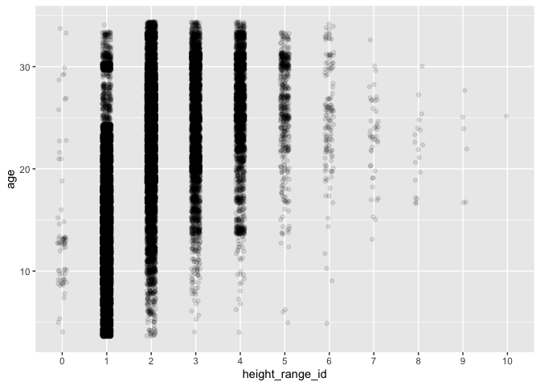

Mini Data Analysis Milestone 2
================

*To complete this milestone, you can either edit [this `.rmd`
file](https://raw.githubusercontent.com/UBC-STAT/stat545.stat.ubc.ca/master/content/mini-project/mini-project-2.Rmd)
directly. Fill in the sections that are commented out with
`<!--- start your work here--->`. When you are done, make sure to knit
to an `.md` file by changing the output in the YAML header to
`github_document`, before submitting a tagged release on canvas.*

# Welcome to the rest of your mini data analysis project!

In Milestone 1, you explored your data. and came up with research
questions. This time, we will finish up our mini data analysis and
obtain results for your data by:

- Making summary tables and graphs
- Manipulating special data types in R: factors and/or dates and times.
- Fitting a model object to your data, and extract a result.
- Reading and writing data as separate files.

We will also explore more in depth the concept of *tidy data.*

**NOTE**: The main purpose of the mini data analysis is to integrate
what you learn in class in an analysis. Although each milestone provides
a framework for you to conduct your analysis, it’s possible that you
might find the instructions too rigid for your data set. If this is the
case, you may deviate from the instructions – just make sure you’re
demonstrating a wide range of tools and techniques taught in this class.

# Instructions

**To complete this milestone**, edit [this very `.Rmd`
file](https://raw.githubusercontent.com/UBC-STAT/stat545.stat.ubc.ca/master/content/mini-project/mini-project-2.Rmd)
directly. Fill in the sections that are tagged with
`<!--- start your work here--->`.

**To submit this milestone**, make sure to knit this `.Rmd` file to an
`.md` file by changing the YAML output settings from
`output: html_document` to `output: github_document`. Commit and push
all of your work to your mini-analysis GitHub repository, and tag a
release on GitHub. Then, submit a link to your tagged release on canvas.

**Points**: This milestone is worth 50 points: 45 for your analysis, and
5 for overall reproducibility, cleanliness, and coherence of the Github
submission.

**Research Questions**: In Milestone 1, you chose two research questions
to focus on. Wherever realistic, your work in this milestone should
relate to these research questions whenever we ask for justification
behind your work. In the case that some tasks in this milestone don’t
align well with one of your research questions, feel free to discuss
your results in the context of a different research question.

# Learning Objectives

By the end of this milestone, you should:

- Understand what *tidy* data is, and how to create it using `tidyr`.
- Generate a reproducible and clear report using R Markdown.
- Manipulating special data types in R: factors and/or dates and times.
- Fitting a model object to your data, and extract a result.
- Reading and writing data as separate files.

# Setup

Begin by loading your data and the tidyverse package below:

``` r
library(datateachr) # <- might contain the data you picked!
library(tidyverse)
```

# Task 1: Process and summarize your data

From milestone 1, you should have an idea of the basic structure of your
dataset (e.g. number of rows and columns, class types, etc.). Here, we
will start investigating your data more in-depth using various data
manipulation functions.

### 1.1 (1 point)

First, write out the 4 research questions you defined in milestone 1
were. This will guide your work through milestone 2:

<!-------------------------- Start your work below ---------------------------->

1.  *How is the height of trees related to their age and the usage of
    root barrier?*
2.  *How is species richness in different neighborhoods related to the
    total number of trees in the neighborhood?*
3.  *What is the relationship between diameter and height? How much
    variation in diameter can be explained by height_range_id?*
4.  *How do trees in different neighborhoods differ in diameter?*
    <!----------------------------------------------------------------------------->

Here, we will investigate your data using various data manipulation and
graphing functions.

### 1.2 (8 points)

Now, for each of your four research questions, choose one task from
options 1-4 (summarizing), and one other task from 4-8 (graphing). You
should have 2 tasks done for each research question (8 total). Make sure
it makes sense to do them! (e.g. don’t use a numerical variables for a
task that needs a categorical variable.). Comment on why each task helps
(or doesn’t!) answer the corresponding research question.

Ensure that the output of each operation is printed!

Also make sure that you’re using dplyr and ggplot2 rather than base R.
Outside of this project, you may find that you prefer using base R
functions for certain tasks, and that’s just fine! But part of this
project is for you to practice the tools we learned in class, which is
dplyr and ggplot2.

**Summarizing:**

1.  Compute the *range*, *mean*, and *two other summary statistics* of
    **one numerical variable** across the groups of **one categorical
    variable** from your data.
2.  Compute the number of observations for at least one of your
    categorical variables. Do not use the function `table()`!
3.  Create a categorical variable with 3 or more groups from an existing
    numerical variable. You can use this new variable in the other
    tasks! *An example: age in years into “child, teen, adult, senior”.*
4.  Compute the proportion and counts in each category of one
    categorical variable across the groups of another categorical
    variable from your data. Do not use the function `table()`!

**Graphing:**

6.  Create a graph of your choosing, make one of the axes logarithmic,
    and format the axes labels so that they are “pretty” or easier to
    read.
7.  Make a graph where it makes sense to customize the alpha
    transparency.

Using variables and/or tables you made in one of the “Summarizing”
tasks:

8.  Create a graph that has at least two geom layers.
9.  Create 3 histograms, with each histogram having different sized
    bins. Pick the “best” one and explain why it is the best.

Make sure it’s clear what research question you are doing each operation
for!

<!------------------------- Start your work below ----------------------------->

#### For research question 1

RQ1: *How is the height of trees related to their age and the usage of
root barrier?*

##### Summarizing

I first convert height_range_id into a factor. We can see that there are
11 levels of height_range_id as a factor.

``` r
# Option 4. Compute the proportion and counts in each category of one categorical variable across the groups of another categorical variable from your data.

#First convert height_range_id into a factor
vancouver_trees$height_range_id <- as_factor(vancouver_trees$height_range_id)
levels(vancouver_trees$height_range_id)
```

    ##  [1] "0"  "1"  "2"  "3"  "4"  "5"  "6"  "7"  "8"  "9"  "10"

Then I computed the proportion and counts in each category of
height_range_id across the groups of root_barrier. I first computed the
proportion and counts in each category of height_range_id using
observations with root_barrier==“N”.

``` r
# For observations with root_barrier=="N", compute the proportion and counts in each category of height_range_id.
vancouver_trees %>%
  filter(root_barrier=="N") %>%
  group_by(height_range_id) %>%
  summarize(n=n()) %>%
  mutate(prop=n/sum(n))
```

    ## # A tibble: 11 × 3
    ##    height_range_id     n      prop
    ##    <fct>           <int>     <dbl>
    ##  1 0                 171 0.00124  
    ##  2 1               32961 0.240    
    ##  3 2               40573 0.295    
    ##  4 3               25993 0.189    
    ##  5 4               20388 0.148    
    ##  6 5                9001 0.0655   
    ##  7 6                5187 0.0377   
    ##  8 7                2223 0.0162   
    ##  9 8                 744 0.00541  
    ## 10 9                 202 0.00147  
    ## 11 10                 12 0.0000873

Then I computed the proportion and counts in each category of
height_range_id using observations with root_barrier==“Y”.

``` r
# For observations with root_barrier=="Y", compute the proportion and counts in each category of height_range_id.
vancouver_trees %>%
  filter(root_barrier=="Y") %>%
  group_by(height_range_id) %>%
  summarize(n=n()) %>%
  mutate(prop=n/sum(n))
```

    ## # A tibble: 10 × 3
    ##    height_range_id     n     prop
    ##    <fct>           <int>    <dbl>
    ##  1 0                  43 0.00470 
    ##  2 1                6998 0.764   
    ##  3 2                1633 0.178   
    ##  4 3                 314 0.0343  
    ##  5 4                 142 0.0155  
    ##  6 5                  13 0.00142 
    ##  7 6                   8 0.000874
    ##  8 7                   2 0.000218
    ##  9 8                   2 0.000218
    ## 10 9                   1 0.000109

As we can see from the counts shown in the two tables above, we have
more trees with no root barrier installed. From the proportions shown,
we can see that about 88% of trees with no root barrier installed have
height_range_id between 1 and 4 (inclusive). However, 94% of trees with
root barrier installed have height_range_id 1 or 2. This task helps
answer research question 1 because we can see from the proportions
computed above that there is an association between height range and
root barrier. Trees without root barrier installed are more likely to
have higher height when.

##### Graphing

I first created a new variable named age. This variable holds the age
data for each tree that has date planted recorded. There are 76,548
observations that do not have date planted recorded.

``` r
# Option 7: Make a graph where it makes sense to customize the alpha transparency.
# for age and the usage of root barrier

# Create the age variable
vancouver_trees_w_age <- vancouver_trees %>%
  mutate(age = 2023-year(date_planted))
# Compute the summary statistics for the age variable
summary(vancouver_trees_w_age$age)
```

    ##    Min. 1st Qu.  Median    Mean 3rd Qu.    Max.    NA's 
    ##    4.00   13.00   19.00   19.14   25.00   34.00   76548

For trees that have date planted recorded, I made a jitterplot to see
how height is related to age because this is a part of research
question 1. Here I customized the alpha transparency to help with the
large amount of overlapping points. As we can see from the plot below,
it seems that there is an positive association between height and age of
trees.

``` r
# jitterplot to show how age is spread within each height_range_id category.
ggplot(vancouver_trees_w_age, aes(height_range_id, age)) + 
    geom_jitter(alpha = 0.1, width=0.1)
```

    ## Warning: Removed 76548 rows containing missing values (`geom_point()`).

<!-- -->

#### For research question 2

RQ2: *How is species richness in different neighborhoods related to the
total number of trees in the neighborhood?*:

##### Summarizing

I computed the species richness and total number of trees for each
neighborhood, and created a new tibble by merging the two summary
tibbles. I then used the new tibble to make a scatterplot to explore the
relationship between species richness and total number of trees.
Therefore, this task help answer the research question.

``` r
#compute species richness for each neighborhood
species_richness_neighbourhood <- vancouver_trees %>%
                                  group_by(neighbourhood_name) %>%
                                  summarize(species_richness =
                                              length(unique(species_name)))

#Summarizing Option 2: Compute the number of observations for each category of the categorical variable neighborhood.

#compute the total number of trees for each neighborhood
total_trees_neighbourhood <- vancouver_trees %>%
                                  group_by(neighbourhood_name) %>%
                                  summarize(n = n())

# Combine into one new tibble
data_QR2 <- left_join(species_richness_neighbourhood, total_trees_neighbourhood, by="neighbourhood_name")

data_QR2
```

    ## # A tibble: 22 × 3
    ##    neighbourhood_name       species_richness     n
    ##    <chr>                               <int> <int>
    ##  1 ARBUTUS-RIDGE                         121  5169
    ##  2 DOWNTOWN                               79  5159
    ##  3 DUNBAR-SOUTHLANDS                     161  9415
    ##  4 FAIRVIEW                              119  4002
    ##  5 GRANDVIEW-WOODLAND                    146  6703
    ##  6 HASTINGS-SUNRISE                      176 10547
    ##  7 KENSINGTON-CEDAR COTTAGE              159 11042
    ##  8 KERRISDALE                            138  6936
    ##  9 KILLARNEY                             122  6148
    ## 10 KITSILANO                             171  8115
    ## # ℹ 12 more rows

##### Graphing

Here I made a scatterplot of species richness against total number of
trees and added the linear fit and local fit to the plot. This help
answer research question 2 because the plot shows the relationship
between species richness and the total number of trees in different
neighborhoods. Based on the plot, higher total number of trees is
associated with higher species richness.

``` r
# Scatterplot of species_richness against total number of trees
ggplot(data_QR2, aes(x = n, y = species_richness)) +
    geom_point() +
    geom_smooth(aes(colour = "loess"), method = "loess", se = FALSE) + 
    geom_smooth(aes(colour = "lm"), method = "lm", se = FALSE) +
    labs(x="Total number of trees", y="Species richness")
```

    ## `geom_smooth()` using formula = 'y ~ x'
    ## `geom_smooth()` using formula = 'y ~ x'

<!-- -->

#### For research question 3

RQ3: *What is the relationship between diameter and height? How much
variation in diameter can be explained by height_range_id?*

##### Summarizing

I computed the range, mean, median, first and third quartiles of the
numerical variable diameter across the groups of the categorical
variable height_range_id. This task helps answer the research question
because it help explore the association between diameter and height. For
example, we can see that trees with larger height_range_id have larger
median diameter.

``` r
# Option 1. Compute the range, mean, median, first and third quartiles of the numerical variable diameter across the groups of the categorical variable height_range_id.
data_RQ3 <- vancouver_trees %>% 
  group_by(height_range_id) %>%
  summarise(
    range = max(diameter)-min(diameter),
    mean_dia = mean(diameter, na.rm = TRUE),
    median_dia = median(diameter),
    Q1_dia = quantile(diameter, 0.25),
    Q3_dia = quantile(diameter, 0.75))

data_RQ3
```

    ## # A tibble: 11 × 6
    ##    height_range_id range mean_dia median_dia Q1_dia Q3_dia
    ##    <fct>           <dbl>    <dbl>      <dbl>  <dbl>  <dbl>
    ##  1 0                55       5.41        3      0      6  
    ##  2 1                86       3.92        3      3      4  
    ##  3 2               435       8.38        7      4     11  
    ##  4 3               141      14.6        13      9     19  
    ##  5 4               316      16.6        15.5   12     19.5
    ##  6 5                98      22.8        22.5   18     27  
    ##  7 6                99      27.3        27     23     31  
    ##  8 7                72.5    30.8        30     26     35  
    ##  9 8                96      33.3        33     28.3   38  
    ## 10 9                65      34.8        35     30     41  
    ## 11 10               47      34.1        39     32.5   42.8

##### Graphing

I made side-by-side boxplots to explore the relationship between
diameter and height. Since there are some very large values in the
diameter variable, I transformed the coordinate system of the boxplot to
help with visualization. I also added a geom_point() layer to show the
mean diameter for each category of height_range_id. This task helps
answer the research question because it help explore the association
between diameter and height.

``` r
# Option 8: Create a graph that has at least two geom layers.
# Explore the relationship between diameter and height_range_id using boxplots.
vancouver_trees %>%
  filter(diameter != 0 ) %>%
  ggplot(aes(height_range_id, diameter)) + 
  geom_boxplot() +
  geom_point(data = data_RQ3, # add the mean diameter computed in last code chunk
             aes(x=height_range_id, y=mean_dia),
             color = 'red') +
  coord_trans(y="log10") #Transforming the coordinate system.
```

<!-- -->

#### For research question 4

RQ4: *How do trees in different neighborhoods differ in diameter?*

##### Summarizing

I computed the range, mean, median, first and third quartiles of the
numerical variable diameter across different neighborhoods. This task
helps answer the research question because it helps explore how tree
diameter differ across neighborhoods. For example, we can see that the
median tree diameter of Downtown is smaller than that of other
neighborhoods.

``` r
# Option 1. Compute the range, mean, median, first and third quartiles of the numerical variable diameter across different neighbourhoods.
data_RQ4 <- vancouver_trees %>% 
  group_by(neighbourhood_name) %>%
  summarise(
    range = max(diameter)-min(diameter),
    mean_dia = mean(diameter, na.rm = TRUE),
    median_dia = median(diameter),
    Q1_dia = quantile(diameter, 0.25),
    Q3_dia = quantile(diameter, 0.75))

data_RQ4
```

    ## # A tibble: 22 × 6
    ##    neighbourhood_name       range mean_dia median_dia Q1_dia Q3_dia
    ##    <chr>                    <dbl>    <dbl>      <dbl>  <dbl>  <dbl>
    ##  1 ARBUTUS-RIDGE             62      11.9        10     4.25   17  
    ##  2 DOWNTOWN                 150       7.45        6     4      10  
    ##  3 DUNBAR-SOUTHLANDS        305      13.9        12     4      22  
    ##  4 FAIRVIEW                  97.8    10.6         9     4      14  
    ##  5 GRANDVIEW-WOODLAND        63      11.4         8.5   4      16  
    ##  6 HASTINGS-SUNRISE         435      11.0         8.5   4      15  
    ##  7 KENSINGTON-CEDAR COTTAGE  99      11.7         9.5   4      16.5
    ##  8 KERRISDALE               156      12.7        10     4      19.5
    ##  9 KILLARNEY                 50      10.1         8     3      14  
    ## 10 KITSILANO                317      14.4        12     5      22  
    ## # ℹ 12 more rows

##### Graphing

I made a boxplot to explore how trees in different neighborhoods differ
in diameter. Again I transformed the coordinate system of the boxplot to
help with visualization. I also added a geom_point() layer to show the
mean diameter for each neighborhood. This task helps answer the research
question because it help visualize the distribution and summary
statistics of diameter for each neighborhood and made it easier for
comparison.

``` r
# Option 8: Create a graph that has at least two geom layers.
# Explore the relationship between diameter and height_range_id using boxplots.
vancouver_trees %>%
  filter(diameter != 0 ) %>%
  ggplot(aes(y=neighbourhood_name, x=diameter)) + 
  geom_boxplot() +
  geom_point(data = data_RQ4, # add the mean diameter computed in last code chunk
             aes(y=neighbourhood_name, x=mean_dia),
             color = 'red') +
  coord_trans(x="log10")  #Transforming the coordinate system.
```

<!-- -->

<!----------------------------------------------------------------------------->

### 1.3 (2 points)

Based on the operations that you’ve completed, how much closer are you
to answering your research questions? Think about what aspects of your
research questions remain unclear. Can your research questions be
refined, now that you’ve investigated your data a bit more? Which
research questions are yielding interesting results?

<!------------------------- Write your answer here ---------------------------->

I think I am definitely closer to answering my research questions. By
doing this data exploration tasks, I get some basic ideas about what the
results of further analysis might be and what the next steps should be.
For example, for research question 2, the scatterplot gives me more idea
on how species richness and the total number of trees in different
neighborhoods relate to each other and whether it is reasonable to use a
linear regression model.

<!----------------------------------------------------------------------------->

# Task 2: Tidy your data

In this task, we will do several exercises to reshape our data. The goal
here is to understand how to do this reshaping with the `tidyr` package.

A reminder of the definition of *tidy* data:

- Each row is an **observation**
- Each column is a **variable**
- Each cell is a **value**

### 2.1 (2 points)

Based on the definition above, can you identify if your data is tidy or
untidy? Go through all your columns, or if you have \>8 variables, just
pick 8, and explain whether the data is untidy or tidy.

<!--------------------------- Start your work below --------------------------->

There are 20 columns in my dataset vancouver_trees. I picked the most
relevant 8 columns (i.e. tree_id, species_name, root_barrier,
neighbourhood_name, height_range_id, diameter, date_planted, curb) for
this task. As we can see from the first 6 rows, my data is tidy. There
is one row per tree (observation). Each column is a variable (a quantity
of interest recorded for each tree). And each cell is a value.

``` r
# print the first 6 rows
data_eight_columns <- vancouver_trees %>%
  select(tree_id, species_name, root_barrier, neighbourhood_name,
         height_range_id, diameter, date_planted, curb) %>%
  head()

data_eight_columns
```

    ## # A tibble: 6 × 8
    ##   tree_id species_name root_barrier neighbourhood_name  height_range_id diameter
    ##     <dbl> <chr>        <chr>        <chr>               <fct>              <dbl>
    ## 1  149556 AMERICANA    N            MARPOLE             2                     10
    ## 2  149563 SERRATA      N            MARPOLE             4                     10
    ## 3  149579 JAPONICA     N            KENSINGTON-CEDAR C… 3                      4
    ## 4  149590 AMERICANA    N            KENSINGTON-CEDAR C… 4                     18
    ## 5  149604 CAMPESTRE    N            KENSINGTON-CEDAR C… 2                      9
    ## 6  149616 CALLERYANA   N            MARPOLE             2                      5
    ## # ℹ 2 more variables: date_planted <date>, curb <chr>

<!----------------------------------------------------------------------------->

### 2.2 (4 points)

Now, if your data is tidy, untidy it! Then, tidy it back to it’s
original state.

If your data is untidy, then tidy it! Then, untidy it back to it’s
original state.

Be sure to explain your reasoning for this task. Show us the “before”
and “after”.

<!--------------------------- Start your work below --------------------------->

Here I did the untidying and tidying back operations on the first 6 rows
of the data_eight_columns to illustrate the idea. These operations can
be repeated to the whole data_eight_columns dataset easily.

I first untidy the first 6 rows of data_eight_columns by using the
transpose_tibble() available online at
<https://rdrr.io/github/allydunham/tblhelpr/src/R/convert_tibbles.R>. As
we can see from the output, the new tibble created is untidy because now
each row is not an observation, and each column is not a varaible. In
the new tibble, each column, except the first column, stores data for
one tree. Each row stores data on one characteristic for all trees.

``` r
# Untidy data_eight_columns
# the tibble_to_matrix() and transpose_tibble() were copied from https://rdrr.io/github/allydunham/tblhelpr/src/R/convert_tibbles.R. The package tblhelpr can't be installed in R. 
tibble_to_matrix <- function(tbl, ..., row_names=NULL){
  cols <- rlang::enquos(...)

  mat <- as.matrix(dplyr::select(tbl, !!! cols))

  if (!is.null(row_names)){
    if (length(row_names) == 1 & row_names[1] %in% colnames(tbl)){
      row_names <- tbl[[row_names]]
    }
    rownames(mat) <- row_names
  }

  return(mat)
}

transpose_tibble <- function(tbl, col_names, id_col = "columns"){
  col_names <- rlang::enquo(col_names)

  tibble_to_matrix(tbl, -!!col_names,
                   row_names = dplyr::pull(tbl, !!col_names)) %>%
    t() %>%
    dplyr::as_tibble(rownames = id_col) %>%
    return()
}

# Use the transpose_tibble() to untidy the first 6 rows of data_eight_columns
untidy_eight_columns <- head(data_eight_columns) %>%
  transpose_tibble(col_names = tree_id, id_col = "Characteristic")

untidy_eight_columns
```

    ## # A tibble: 7 × 7
    ##   Characteristic     `149556`   `149563`   `149579`   `149590` `149604` `149616`
    ##   <chr>              <chr>      <chr>      <chr>      <chr>    <chr>    <chr>   
    ## 1 species_name       AMERICANA  SERRATA    "JAPONICA" AMERICA… "CAMPES… "CALLER…
    ## 2 root_barrier       N          N          "N"        N        "N"      "N"     
    ## 3 neighbourhood_name MARPOLE    MARPOLE    "KENSINGT… KENSING… "KENSIN… "MARPOL…
    ## 4 height_range_id    2          4          "3"        4        "2"      "2"     
    ## 5 diameter           10         10         " 4"       18       " 9"     " 5"    
    ## 6 date_planted       1999-01-13 1996-05-31 "1993-11-… 1996-04… "1993-1…  <NA>   
    ## 7 curb               N          N          "Y"        Y        "Y"      "Y"

Now I used the transpose_tibble() function to tidy the first 6 rows of
data_eight_columns back to it’s original state.

``` r
# Use the transpose_tibble() to tidy the first 6 rows of data_eight_columns back to it’s original state
tidy_back_eight_columns <- head(untidy_eight_columns) %>%
  transpose_tibble(col_names = Characteristic, id_col = "tree_id")

tidy_back_eight_columns <- tidy_back_eight_columns %>%
  mutate(tree_id=as.double(tree_id), height_range_id=as.factor(height_range_id),
         diameter=as.double(diameter), date_planted=as.Date(date_planted))

print(tidy_back_eight_columns)
```

    ## # A tibble: 6 × 7
    ##   tree_id species_name root_barrier neighbourhood_name  height_range_id diameter
    ##     <dbl> <chr>        <chr>        <chr>               <fct>              <dbl>
    ## 1  149556 AMERICANA    N            MARPOLE             2                     10
    ## 2  149563 SERRATA      N            MARPOLE             4                     10
    ## 3  149579 JAPONICA     N            KENSINGTON-CEDAR C… 3                      4
    ## 4  149590 AMERICANA    N            KENSINGTON-CEDAR C… 4                     18
    ## 5  149604 CAMPESTRE    N            KENSINGTON-CEDAR C… 2                      9
    ## 6  149616 CALLERYANA   N            MARPOLE             2                      5
    ## # ℹ 1 more variable: date_planted <date>

<!----------------------------------------------------------------------------->

### 2.3 (4 points)

Now, you should be more familiar with your data, and also have made
progress in answering your research questions. Based on your interest,
and your analyses, pick 2 of the 4 research questions to continue your
analysis in the remaining tasks:

<!-------------------------- Start your work below ---------------------------->

1.  RQ 2: *How is species richness in different neighborhoods related to
    the total number of trees in the neighborhood?*
2.  RQ 3: *What is the relationship between diameter and height? How
    much variation in diameter can be explained by height_range_id?*

<!----------------------------------------------------------------------------->

Explain your decision for choosing the above two research questions.

<!--------------------------- Start your work below --------------------------->

I choose the RQ 2 and RQ 3 from the four research questions. I choose RQ
2 because I can see from the scatterplor I made above that there is a
positive association between species richness and total number of trees.
I choose RQ 3 because based on the boxplot I made above, height_range_id
should explain some variation in diameter.
<!----------------------------------------------------------------------------->

Now, try to choose a version of your data that you think will be
appropriate to answer these 2 questions. Use between 4 and 8 functions
that we’ve covered so far (i.e. by filtering, cleaning, tidy’ing,
dropping irrelevant columns, etc.).

(If it makes more sense, then you can make/pick two versions of your
data, one for each research question.)

<!--------------------------- Start your work below
--------------------------->

For RQ 2, I need the columns tree_id, neighbourhood_name to compute the
total number of trees for each neighbourhood. I need the columns
species_name and neighbourhood_name to compute the species richnessfor
each neighbourhood. I also removed rows with NA value in any column from
the newly created dataset.

``` r
Data_for_RQ2 <- vancouver_trees %>%
  select(tree_id, species_name, neighbourhood_name) %>%
  na.omit() #remove rows with NA value in any column

head(Data_for_RQ2)
```

    ## # A tibble: 6 × 3
    ##   tree_id species_name neighbourhood_name      
    ##     <dbl> <chr>        <chr>                   
    ## 1  149556 AMERICANA    MARPOLE                 
    ## 2  149563 SERRATA      MARPOLE                 
    ## 3  149579 JAPONICA     KENSINGTON-CEDAR COTTAGE
    ## 4  149590 AMERICANA    KENSINGTON-CEDAR COTTAGE
    ## 5  149604 CAMPESTRE    KENSINGTON-CEDAR COTTAGE
    ## 6  149616 CALLERYANA   MARPOLE

After creating Data_for_RQ2, I also created another new tibble called
data_RQ2 for the regression analysis. In data_RQ2, I have the species
richness and total number of trees computed for each neighborhood.

``` r
#compute species richness for each neighborhood
species_richness_neighbourhood <- vancouver_trees %>%
                                  group_by(neighbourhood_name) %>%
                                  summarize(species_richness =
                                  length(unique(species_name)))

#compute the total number of trees for each neighborhood
total_trees_neighbourhood <- vancouver_trees %>%
                                  group_by(neighbourhood_name) %>%
                                  summarize(n = n())

# Combine into one new tibble
data_QR2 <- left_join(species_richness_neighbourhood, total_trees_neighbourhood, by="neighbourhood_name")

data_QR2
```

    ## # A tibble: 22 × 3
    ##    neighbourhood_name       species_richness     n
    ##    <chr>                               <int> <int>
    ##  1 ARBUTUS-RIDGE                         121  5169
    ##  2 DOWNTOWN                               79  5159
    ##  3 DUNBAR-SOUTHLANDS                     161  9415
    ##  4 FAIRVIEW                              119  4002
    ##  5 GRANDVIEW-WOODLAND                    146  6703
    ##  6 HASTINGS-SUNRISE                      176 10547
    ##  7 KENSINGTON-CEDAR COTTAGE              159 11042
    ##  8 KERRISDALE                            138  6936
    ##  9 KILLARNEY                             122  6148
    ## 10 KITSILANO                             171  8115
    ## # ℹ 12 more rows

For RQ 3, I need the columns diameter and height_range_id. I also
removed rows with NA value in any column from the newly created dataset.

``` r
Data_for_RQ3 <- vancouver_trees %>%
  select(tree_id, diameter, height_range_id) %>%
  na.omit() #remove rows with NA value in any column

head(Data_for_RQ3)
```

    ## # A tibble: 6 × 3
    ##   tree_id diameter height_range_id
    ##     <dbl>    <dbl> <fct>          
    ## 1  149556       10 2              
    ## 2  149563       10 4              
    ## 3  149579        4 3              
    ## 4  149590       18 4              
    ## 5  149604        9 2              
    ## 6  149616        5 2

# Task 3: Modelling

## 3.0 (no points)

Pick a research question from 1.2, and pick a variable of interest
(we’ll call it “Y”) that’s relevant to the research question. Indicate
these.

<!-------------------------- Start your work below ---------------------------->

**Research Question**: RQ 2: How is species richness in different
neighborhoods related to the total number of trees in the neighborhood?:

**Variable of interest**: species richness

<!----------------------------------------------------------------------------->

## 3.1 (3 points)

Fit a model or run a hypothesis test that provides insight on this
variable with respect to the research question. Store the model object
as a variable, and print its output to screen. We’ll omit having to
justify your choice, because we don’t expect you to know about model
specifics in STAT 545.

- **Note**: It’s OK if you don’t know how these models/tests work. Here
  are some examples of things you can do here, but the sky’s the limit.

  - You could fit a model that makes predictions on Y using another
    variable, by using the `lm()` function.
  - You could test whether the mean of Y equals 0 using `t.test()`, or
    maybe the mean across two groups are different using `t.test()`, or
    maybe the mean across multiple groups are different using `anova()`
    (you may have to pivot your data for the latter two).
  - You could use `lm()` to test for significance of regression
    coefficients.

<!-------------------------- Start your work below ---------------------------->

Here I fitted a linear regression model that makes predictions on
species richness of a neighborhood using the total number of trees (with
100 as unit) in that neighborhood. The output was printed below.

``` r
# fit a linear regression model
model1 <- lm(species_richness ~ I(n/100), data_QR2)
print(model1)
```

    ## 
    ## Call:
    ## lm(formula = species_richness ~ I(n/100), data = data_QR2)
    ## 
    ## Coefficients:
    ## (Intercept)     I(n/100)  
    ##     93.3841       0.6831

<!----------------------------------------------------------------------------->

## 3.2 (3 points)

Produce something relevant from your fitted model: either predictions on
Y, or a single value like a regression coefficient or a p-value.

- Be sure to indicate in writing what you chose to produce.
- Your code should either output a tibble (in which case you should
  indicate the column that contains the thing you’re looking for), or
  the thing you’re looking for itself.
- Obtain your results using the `broom` package if possible. If your
  model is not compatible with the broom function you’re needing, then
  you can obtain your results by some other means, but first indicate
  which broom function is not compatible.

<!-------------------------- Start your work below ---------------------------->

Here I chose to produce the estimated slope and its p-value. According
to the R output, the estimated slope is 0.6831346, and its p-value is
very close to 0.

``` r
print(broom::tidy(model1))
```

    ## # A tibble: 2 × 5
    ##   term        estimate std.error statistic       p.value
    ##   <chr>          <dbl>     <dbl>     <dbl>         <dbl>
    ## 1 (Intercept)   93.4       9.33      10.0  0.00000000313
    ## 2 I(n/100)       0.683     0.132      5.18 0.0000453

<!----------------------------------------------------------------------------->

# Task 4: Reading and writing data

Get set up for this exercise by making a folder called `output` in the
top level of your project folder / repository. You’ll be saving things
there.

## 4.1 (3 points)

Take a summary table that you made from Task 1, and write it as a csv
file in your `output` folder. Use the `here::here()` function.

- **Robustness criteria**: You should be able to move your Mini Project
  repository / project folder to some other location on your computer,
  or move this very Rmd file to another location within your project
  repository / folder, and your code should still work.
- **Reproducibility criteria**: You should be able to delete the csv
  file, and remake it simply by knitting this Rmd file.

<!-------------------------- Start your work below ---------------------------->

Here I wrote data_RQ3 as a csv file in the output folder.

``` r
#write data_RQ3 as a csv file in the output folder
write_csv(data_RQ3, file = here::here("output","summary_table_RQ3.csv"))
```

<!----------------------------------------------------------------------------->

## 4.2 (3 points)

Write your model object from Task 3 to an R binary file (an RDS), and
load it again. Be sure to save the binary file in your `output` folder.
Use the functions `saveRDS()` and `readRDS()`.

- The same robustness and reproducibility criteria as in 4.1 apply here.

<!-------------------------- Start your work below ---------------------------->

Here I wrote model1 from Task 3 to an R binary file (an RDS), and load
it again.

``` r
#write model1 as a csv file in the output folder
saveRDS(model1, file= here::here("output","model_1.rds"))
#load it again
model_read <- readRDS(file= here::here("output","model_1.rds"))
print(model_read)
```

    ## 
    ## Call:
    ## lm(formula = species_richness ~ I(n/100), data = data_QR2)
    ## 
    ## Coefficients:
    ## (Intercept)     I(n/100)  
    ##     93.3841       0.6831

<!----------------------------------------------------------------------------->

# Overall Reproducibility/Cleanliness/Coherence Checklist

Here are the criteria we’re looking for.

## Coherence (0.5 points)

The document should read sensibly from top to bottom, with no major
continuity errors.

The README file should still satisfy the criteria from the last
milestone, i.e. it has been updated to match the changes to the
repository made in this milestone.

## File and folder structure (1 points)

You should have at least three folders in the top level of your
repository: one for each milestone, and one output folder. If there are
any other folders, these are explained in the main README.

Each milestone document is contained in its respective folder, and
nowhere else.

Every level-1 folder (that is, the ones stored in the top level, like
“Milestone1” and “output”) has a `README` file, explaining in a sentence
or two what is in the folder, in plain language (it’s enough to say
something like “This folder contains the source for Milestone 1”).

## Output (1 point)

All output is recent and relevant:

- All Rmd files have been `knit`ted to their output md files.
- All knitted md files are viewable without errors on Github. Examples
  of errors: Missing plots, “Sorry about that, but we can’t show files
  that are this big right now” messages, error messages from broken R
  code
- All of these output files are up-to-date – that is, they haven’t
  fallen behind after the source (Rmd) files have been updated.
- There should be no relic output files. For example, if you were
  knitting an Rmd to html, but then changed the output to be only a
  markdown file, then the html file is a relic and should be deleted.

Our recommendation: delete all output files, and re-knit each
milestone’s Rmd file, so that everything is up to date and relevant.

## Tagged release (0.5 point)

You’ve tagged a release for Milestone 2.

### Attribution

Thanks to Victor Yuan for mostly putting this together.
